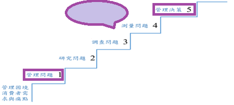
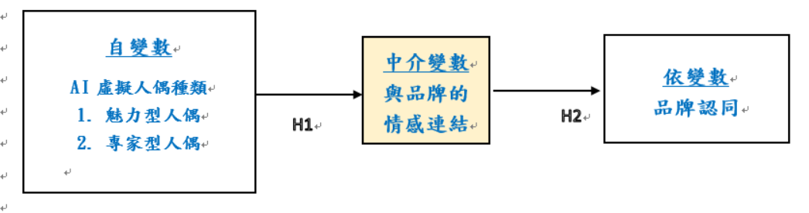
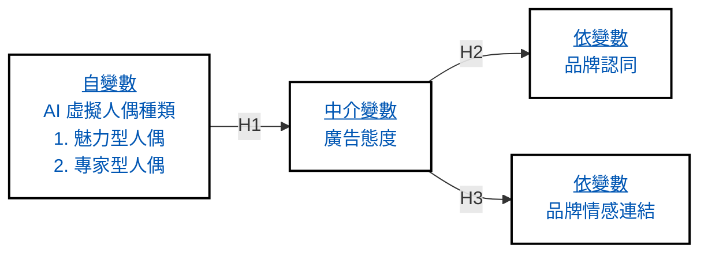

第五週作業，請參照下列說明及範例
本週作業練習重點: 
1.	請為你的案例企業，以問卷調查法設計資料收集規劃。
2.	請進行設計細部步驟:  
    (1) 根據研究主題，請以80字之內的篇幅提出<請求合作>的文案；  
    (2) 檢視個人繪製的研究模型，其中有那些主要變數需要設計問卷？  
    (3) 針對以上變數所設計的問題與答案，將採用開放式或封閉式問卷設計？  
    (4) 請提出<基本資料>的8-10個題目設計 (每個題目需搭配適當的尺度)；  
    (5) 使用校內圖書館網站之資料庫，針對步驟(2)挑選出1-2個變數，並找到至少一篇國外期刊論文(排名最好是Q3之內, Q4不行)或一篇國內期刊論文，這兩篇論文必須內含所選變數的問項與尺度；  
    (6) 請注意：管理決策5與管理問題1才是如何挑選(4)中所找到的期刊論文，到底應該挑選哪些問項與尺度的重要依歸；  
    (7) 請注意：步驟(5)中所選的問項與尺度，必須跟自己所提出之表2「研究變數說明表」校準與一致。

|  |  |
| :---: | :---: |
| **圖1 企業研究之階梯層級示意圖** | **圖2 所選案例,自己定義出的研究模型** |

作業繳交格式:
1.	請參考圖1與2，根據自己的案例，填寫黃色區塊
2.	請把報導案例放在最末頁
3.	請將完成之作業 (WORD格式) 上傳至Moodle開設之作業區(檔名:學號_姓名)
有任何問題，歡迎提問

**表1 問卷調查設計之程序說明表**

<table width="100%" style="border-collapse: collapse; text-align: left;">
  <tbody>
    <tr>
      <th width="35%" style="border: 1px solid #ccc; padding: 8px;">研究主題:</th>
      <td colspan="3" style="border: 1px solid #ccc; background-color: #FFF6D9; padding: 8px;"></td>
    </tr>
    <tr>
      <th style="border: 1px solid #ccc; padding: 8px;">1 以 80 字以內，提出&lt;合作請求&gt;文案</th>
      <td colspan="3" style="border: 1px solid #ccc; background-color: #FFF6D9; padding: 8px;"></td>
    </tr>
    <tr>
      <th style="border: 1px solid #ccc; padding: 8px;">2 挑選 1-2 個主要變數</th>
      <td colspan="3" style="border: 1px solid #ccc; background-color: #FFF6D9; padding: 8px;"></td>
    </tr>
    <tr>
      <th style="border: 1px solid #ccc; padding: 8px;">3 選擇開放式/封閉式設計</th>
      <td colspan="3" style="border: 1px solid #ccc; background-color: #FFF6D9; padding: 8px;"></td>
    </tr>
    <tr>
      <th style="border: 1px solid #ccc; padding: 8px;">4 設計 8-10 個基本資料與主題相關之行為調查問題</th>
      <td colspan="3" style="border: 1px solid #ccc; background-color: #FFF6D9; padding: 8px;"></td>
    </tr>
    <tr>
      <td colspan="4" style="border: 1px solid #ccc; padding: 8px; font-weight: bold;">5 列出所選問項與所引用之文獻(需與表2與圖2校準)</td>
    </tr>
    <tr style="background-color: #FFF6D9;">
      <th width="25%" style="border: 1px solid #ccc; padding: 8px;">研究變數</th>
      <th width="25%" style="border: 1px solid #ccc; padding: 8px;">操作型定義</th>
      <th width="25%" style="border: 1px solid #ccc; padding: 8px;">問項&尺度</th>
      <th width="25%" style="border: 1px solid #ccc; padding: 8px;">文獻</th>
    </tr>
    <tr style="background-color: #FFF6D9;">
      <td style="border: 1px solid #ccc; padding: 15px;"> </td>
      <td style="border: 1px solid #ccc; padding: 15px;"> </td>
      <td style="border: 1px solid #ccc; padding: 15px;"> </td>
      <td style="border: 1px solid #ccc; padding: 15px;"> </td>
    </tr>
    <tr style="background-color: #FFF6D9;">
      <td style="border: 1px solid #ccc; padding: 15px;"> </td>
      <td style="border: 1px solid #ccc; padding: 15px;"> </td>
      <td style="border: 1px solid #ccc; padding: 15px;"> </td>
      <td style="border: 1px solid #ccc; padding: 15px;"> </td>
    </tr>
  </tbody>
</table>

針對以上的研究問題，請列出自變數、依變數、以及以上變數的概念型定義與操作型定義。
**表 2 研究變數說明表**

<table width="100%" style="border-collapse: collapse; text-align: left;">
  <thead>
    <tr>
      <th width="15%" style="border: 1px solid #ccc; padding: 8px; background-color: #FFF;">變數名稱</th>
      <th width="35%" style="border: 1px solid #ccc; padding: 8px; background-color: #FFF;">概念型定義</th>
      <th width="35%" style="border: 1px solid #ccc; padding: 8px; background-color: #FFF;">操作型定義</th>
      <th width="15%" style="border: 1px solid #ccc; padding: 8px; background-color: #FFF;">文獻</th>
    </tr>
  </thead>
  <tbody style="color: #0056b3; background-color: #FFE5D4;">
    <tr>
      <td style="border: 1px solid #ccc; padding: 8px;">AI 虛擬人偶</td>
      <td style="border: 1px solid #ccc; padding: 8px;">AI 虛擬人偶（AI Virtual Human）是一種透過人工智慧技術建構的虛擬角色，其應用涵蓋品牌行銷、娛樂、教育、客服、社群媒體等領域。</td>
      <td style="border: 1px solid #ccc; padding: 8px;">虛擬人偶可依據其外型特性分類為魅力型與專家型人偶。</td>
      <td style="border: 1px solid #ccc; padding: 8px;"></td>
    </tr>
    <tr>
      <td style="border: 1px solid #ccc; padding: 8px;">廣告態度</td>
      <td style="border: 1px solid #ccc; padding: 8px;">如上例</td>
      <td style="border: 1px solid #ccc; padding: 8px;">如上例</td>
      <td style="border: 1px solid #ccc; padding: 8px;"></td>
    </tr>
    <tr>
      <td style="border: 1px solid #ccc; padding: 8px;">品牌認同</td>
      <td style="border: 1px solid #ccc; padding: 8px;">如上例</td>
      <td style="border: 1px solid #ccc; padding: 8px;">如上例</td>
      <td style="border: 1px solid #ccc; padding: 8px;"></td>
    </tr>
    <tr>
      <td style="border: 1px solid #ccc; padding: 8px;">品牌情感連結</td>
      <td style="border: 1px solid #ccc; padding: 8px;">如上例</td>
      <td style="border: 1px solid #ccc; padding: 8px;">如上例</td>
      <td style="border: 1px solid #ccc; padding: 8px;"></td>
    </tr>
  </tbody>
</table>

 

<table width="100%" style="border-collapse: collapse; text-align: left;">
  <thead>
    <tr>
      <th width="80%" style="border: 1px solid #ccc; padding: 8px; background-color: #FFF;">假設</th>
      <th width="20%" style="border: 1px solid #ccc; padding: 8px; background-color: #FFF;">文獻</th>
    </tr>
  </thead>
  <tbody style="background-color: #FFE5D4;">
    <tr>
      <td style="border: 1px solid #ccc; padding: 8px;">H1:AI 虛擬人偶的種類會正向地顯著影響廣告態度</td>
      <td style="border: 1px solid #ccc; padding: 8px;"></td>
    </tr>
    <tr>
      <td style="border: 1px solid #ccc; padding: 8px;">H2:廣告態度會正向地顯著影響品牌認同</td>
      <td style="border: 1px solid #ccc; padding: 8px;"></td>
    </tr>
    <tr>
      <td style="border: 1px solid #ccc; padding: 8px;">H3:廣告態度會正向地顯著影響品牌情感連結</td>
      <td style="border: 1px solid #ccc; padding: 8px;"></td>
    </tr>
  </tbody>
</table>

 

**研究模型示意圖**

