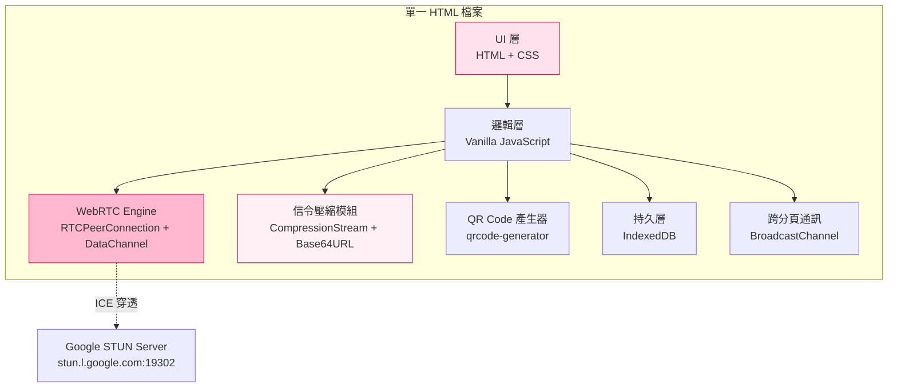
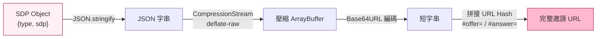
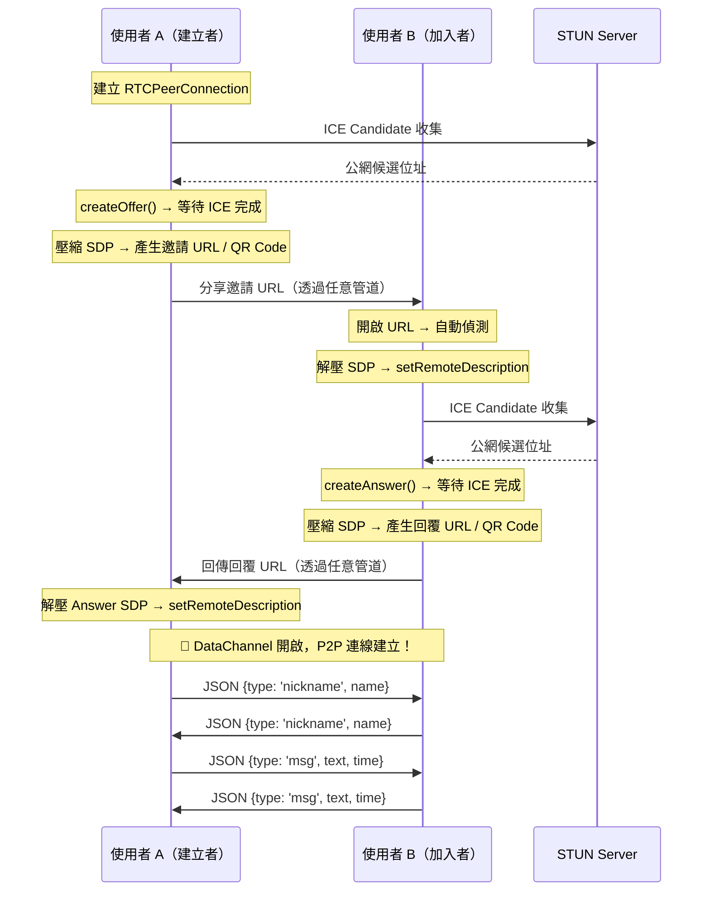
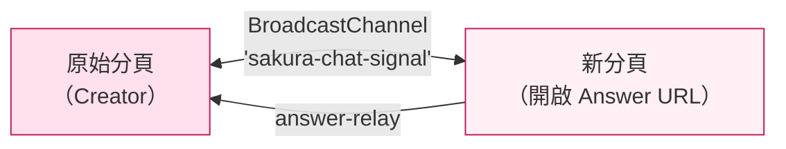
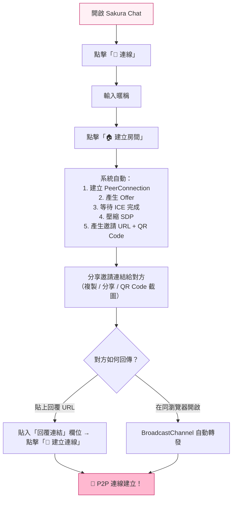
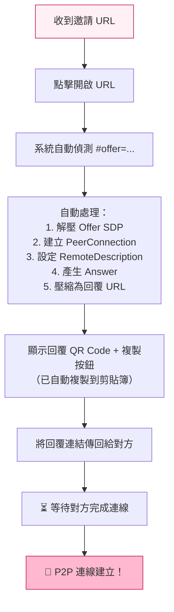

# 🌸 Sakura Chat — 技術架構與使用流程文件

> **版本**: v2  
> **類型**: 純前端 Single-Page Application（零伺服器）  
> **原始檔**: [`Sakura_v2.html`](file:///c:/Playground26/wiskinglin.github.io/_dev/tool_crafting/Sakura_v2.html)

---

## 1. 專案概述

Sakura Chat 是一個 **零伺服器、端對端** 的 P2P 私密聊天工具。整個應用打包在單一 HTML 檔案中，不依賴任何後端服務，利用 WebRTC DataChannel 在瀏覽器之間直接傳輸訊息，並透過 **URL Hash / QR Code** 完成信令交換（Signaling），取代傳統需要信令伺服器的流程。

### 核心特色

| 特色 | 說明 |
|------|------|
| 🚫 零伺服器 | 不需要架設任何後端，信令透過 URL / QR Code 手動傳遞 |
| 🔒 端對端連線 | WebRTC DataChannel 直連，資料不經過第三方 |
| 📱 QR Code 邀請 | 自動產生 QR Code，掃描即可加入 |
| 🔗 URL 自動偵測 | 開啟含有 `#offer=` / `#answer=` 的 URL 自動處理信令 |
| 💾 離線歷史紀錄 | IndexedDB 儲存聊天紀錄，重新開啟可載入 |
| 🌸 櫻花動畫 | CSS 純動畫背景花瓣飄落效果 |
| 😊 內建 Emoji 面板 | 分類式 Emoji 選擇器 |

---

## 2. 技術架構

### 2.1 架構總覽



### 2.2 技術棧

| 層級 | 技術 | 用途 |
|------|------|------|
| **UI 框架** | Vanilla HTML/CSS | 零依賴，單檔結構 |
| **字型** | Noto Sans TC (Google Fonts) | 中文顯示最佳化 |
| **P2P 通訊** | WebRTC `RTCPeerConnection` + `DataChannel` | 瀏覽器間直接傳訊 |
| **ICE/STUN** | `stun.l.google.com:19302`、`stun1.l.google.com:19302` | NAT 穿透，取得公網候選位址 |
| **信令壓縮** | `CompressionStream('deflate-raw')` + Base64URL | 將 SDP 壓縮為短字串嵌入 URL Hash |
| **QR Code** | `qrcode-generator@1.4.4` (CDN) | 將邀請/回覆 URL 渲染為 QR Code |
| **持久儲存** | IndexedDB (`SakuraChatDB`) | 聊天紀錄本地持久化 |
| **跨分頁通訊** | `BroadcastChannel('sakura-chat-signal')` | 在同源分頁間傳遞 Answer SDP |
| **動畫** | 純 CSS `@keyframes` | 花瓣飄落、訊息彈入、脈衝指示燈 |

### 2.3 SDP 壓縮管線

信令資料（SDP Offer/Answer）原始大小通常 2-5 KB，透過以下管線壓縮後嵌入 URL Hash：



**Fallback 機制**：若瀏覽器不支援 `CompressionStream`（如某些舊版瀏覽器），退回 `btoa()` 純 Base64 編碼。

### 2.4 資料流架構



---

## 3. 模組設計

### 3.1 狀態管理

所有狀態以模組級變數管理（無框架）：

```javascript
let nickname = '';        // 使用者暱稱
let peerName = '對方';    // 對方暱稱
let dataChannel = null;   // WebRTC DataChannel 實例
let db = null;            // IndexedDB 連線
let emojiOpen = false;    // Emoji 面板開關
let isConnected = false;  // 連線狀態
let inviteURL = '';       // 產生的邀請 URL
let answerURL = '';       // 產生的回覆 URL
let currentRole = '';     // 'creator' | 'joiner'
let pc = null;            // RTCPeerConnection 實例
```

### 3.2 核心模組拆解

#### A. 信令壓縮模組 (`compressSDP` / `decompressSDP`)

| 函式 | 說明 |
|------|------|
| `compressSDP(sdpObj)` | SDP → JSON → deflate-raw → Base64URL 字串 |
| `decompressSDP(encoded)` | Base64URL → inflate → JSON → SDP Object |
| `stripSDP(desc)` | 從 RTCSessionDescription 中萃取 `{type, sdp}` |
| `buildInviteURL(encoded)` | 拼接 `origin + pathname + #offer=<encoded>` |
| `buildAnswerURL(encoded)` | 拼接 `origin + pathname + #answer=<encoded>` |
| `parseURLSignal()` | 解析 `location.hash`，回傳 `{type, data}` 或 `null` |

#### B. WebRTC 模組

| 函式 | 說明 |
|------|------|
| `createPeerConnection()` | 建立 RTCPeerConnection，設定 STUN、監聽斷線 |
| `waitForICE()` | 等待 ICE 收集完成（timeout 5 秒） |
| `setupDataChannel(channel)` | 設定 DataChannel 的 `onopen`、`onclose`、`onmessage` |

#### C. 連線流程模組

| 函式 | 角色 | 說明 |
|------|------|------|
| `startCreate()` | Creator | 建立 Offer → 壓縮 → 產生 QR + URL |
| `applyAnswer()` | Creator | 接收 Answer URL/SDP → `setRemoteDescription` |
| `startJoin()` | Joiner | 進入手動加入介面 |
| `joinRoom()` | Joiner | 貼上 Offer → 產生 Answer → 壓縮 → QR + URL |
| `autoHandleOffer(encoded)` | Joiner | URL 自動偵測：解壓 Offer → 自動產生 Answer |
| `autoHandleAnswer(encoded)` | Creator/Relay | URL 自動偵測：解壓 Answer → 連線 / 跨分頁轉發 |

#### D. 跨分頁通訊模組 (`BroadcastChannel`)



當使用者 A 在新分頁中開啟 Answer URL 時，`autoHandleAnswer` 會透過 `BroadcastChannel` 將 Answer SDP 傳回原始的 Creator 分頁，實現自動連線。

#### E. 持久層（IndexedDB）

| 函式 | 說明 |
|------|------|
| `initDB()` | 開啟 `SakuraChatDB`，建立 `messages` Store |
| `saveToDB(record)` | 寫入一筆 `{type, text, time, name}` |
| `loadChatHistory()` | 載入最近 100 筆歷史訊息 |

**資料庫結構**：

| Database | Object Store | Key | Index |
|----------|-------------|-----|-------|
| `SakuraChatDB` (v1) | `messages` | `autoIncrement` | `time` |

**記錄格式**：
```json
{
  "type": "self | peer | system",
  "text": "訊息內容",
  "time": 1713000000000,
  "name": "暱稱"
}
```

#### F. UI 元件

| 元件 | 說明 |
|------|------|
| `#petals-container` | 18 片隨機大小/速度的 CSS 動畫花瓣 |
| `#header` | 漸層背景標頭、連線狀態指示燈、連線按鈕 |
| `#chat-area` | 訊息顯示區，支援自動滾動 |
| `#emoji-picker` | 6 分類 Emoji 面板（表情/手勢/愛心/自然/食物/娛樂） |
| `#input-bar` | 訊息輸入欄 + 發送按鈕 + Emoji 按鈕 |
| `#modal-overlay` | 連線設定 Modal（建立/加入房間） |
| `#auto-join-overlay` | URL 自動加入全螢幕 Overlay |
| `#toast` | 頂部滑入式通知提示 |

---

## 4. 使用流程

### 4.1 流程一：建立房間（Creator 端）



**操作步驟**：

1. 開啟 Sakura Chat 頁面
2. 點擊右上角「🔗 連線」按鈕
3. 輸入暱稱（可選，預設為「櫻花使用者」）
4. 選擇「🏠 建立房間」
5. 等待系統產生邀請 URL 及 QR Code（邀請連結會自動複製到剪貼簿）
6. 透過任意管道將邀請連結傳給對方（Line、Messenger、Email 等）
7. 等待對方回傳回覆連結，貼入後點擊「🔗 建立連線」
8. 連線成功！開始聊天

### 4.2 流程二：加入房間（Joiner 端 — 自動模式）



**操作步驟**：

1. 收到邀請連結（URL 帶有 `#offer=...`）
2. 在瀏覽器中開啟連結
3. 系統自動偵測並處理，無需任何操作
4. 回覆連結自動複製到剪貼簿，同時顯示 QR Code
5. 將回覆連結傳回給建立者
6. 等待連線建立完成

### 4.3 流程三：加入房間（Joiner 端 — 手動模式）

1. 開啟 Sakura Chat 頁面
2. 點擊「🔗 連線」→ 選擇「🚪 加入房間」
3. 將邀請連結或邀請碼貼入輸入框
4. 點擊「🌸 確認加入」
5. 系統產生回覆連結 + QR Code
6. 傳回給建立者

### 4.4 流程四：跨分頁自動連線

當建立者（A）在**同一瀏覽器**中開啟回覆 URL 時：

1. 新分頁偵測到 `#answer=...`
2. 透過 `BroadcastChannel` 將 Answer SDP 傳至原始分頁
3. 原始分頁自動呼叫 `setRemoteDescription`
4. 新分頁顯示「✅ 已傳送至原始分頁」
5. 連線自動建立

---

## 5. DataChannel 訊息協定

所有 DataChannel 訊息以 JSON 格式傳輸：

### 暱稱交換（連線建立後立即發送）
```json
{
  "type": "nickname",
  "name": "使用者暱稱"
}
```

### 聊天訊息
```json
{
  "type": "msg",
  "text": "訊息內容文字",
  "time": 1713000000000
}
```

---

## 6. UI 設計系統

### 6.1 色彩系統（CSS Custom Properties）

| 變數 | 色值 | 用途 |
|------|------|------|
| `--sakura-50` | `#FFF0F5` | 背景底色 |
| `--sakura-100` | `#FFE0EC` | 邊框、分隔線 |
| `--sakura-200` | `#FFB8D0` | 輸入框邊框、scrollbar |
| `--sakura-300` | `#FF8FB4` | Hover 強調 |
| `--sakura-400` | `#FF6B9D` | 主色調 |
| `--sakura-500` | `#FF4081` | 強調色 |
| `--sakura-600` | `#E91E6C` | 標籤文字 |
| `--sakura-700` | `#C2185B` | 深色文字 |
| `--sakura-800` | `#8E1248` | 最深色 |
| `--sakura-grad` | `135deg, #FF6B9D → #FF8FB4 → #C2185B` | 主漸層（Header、按鈕） |
| `--sakura-grad-soft` | `135deg, #FFB8D0 → #FF8FB4` | 柔和漸層（發送的訊息氣泡） |

### 6.2 響應式設計

- 最大寬度 `520px`，置中顯示
- `>521px` 左右加邊框區隔
- `visualViewport` API 監聽鍵盤彈出（行動裝置優化）
- `user-scalable=no` 防止雙指縮放

### 6.3 動畫列表

| 動畫名稱 | 目標 | 效果 |
|----------|------|------|
| `petalFall` | `.petal` | 花瓣從上方飄落並旋轉 |
| `msgIn` | `.msg` | 訊息從下方淡入 |
| `pulse-dot` | `.status-dot.connected` | 連線指示燈脈衝發光 |
| `pulse-text` | `.waiting-text` | 等待文字閃爍 |
| `spin` | `.spinner` / `.spinner-dark` | 載入旋轉動畫 |

---

## 7. 外部依賴

| 依賴 | 版本 | 來源 | 大小 | 用途 |
|------|------|------|------|------|
| `qrcode-generator` | 1.4.4 | jsDelivr CDN | ~13 KB | QR Code 產生 |
| Noto Sans TC | - | Google Fonts | 按需載入 | 中文字型 |

> [!NOTE]
> 除上述兩個 CDN 資源外，應用不依賴任何外部服務（STUN 伺服器僅用於 NAT 穿透，不傳輸聊天內容）。

---

## 8. 安全性考量

| 面向 | 現況 | 說明 |
|------|------|------|
| 傳輸安全 | ✅ WebRTC DTLS 加密 | DataChannel 預設使用 DTLS，資料在傳輸中加密 |
| 信令安全 | ⚠️ URL 明文傳遞 | SDP 經壓縮但非加密，攔截 URL 可能取得連線資訊 |
| 訊息加密 | ❌ 無端對端加密層 | 目前 DataChannel 上的訊息為明文 JSON |
| 伺服器信任 | ✅ 零伺服器 | 沒有第三方伺服器可以存取聊天內容 |
| XSS 防護 | ✅ `escapeHTML()` | 所有使用者輸入經 HTML 跳脫處理 |
| 本地儲存 | ⚠️ IndexedDB 無加密 | 聊天紀錄以明文儲存在本地 |

---

## 9. 已知限制

| 限制 | 說明 |
|------|------|
| **1 對 1** | 目前僅支援兩人連線，不支援群組 |
| **無 TURN 伺服器** | 嚴格對稱型 NAT 後的裝置可能無法穿透 |
| **URL 長度** | 壓縮後的 SDP 仍可能超過某些瀏覽器的 URL 長度限制 |
| **無斷線重連** | 連線斷開後需重新走信令流程 |
| **無推播通知** | 瀏覽器分頁在背景時無法收到通知 |
| **CDN 依賴** | QR Code 庫與字型需網路載入 |

---

## 10. 潛在改進方向

| 方向 | 優先級 | 說明 |
|------|--------|------|
| 端對端加密（E2EE） | 🔴 高 | 在 DataChannel 上加入 Curve25519 金鑰交換 + AES-GCM 加密 |
| 檔案傳輸 | 🟡 中 | 利用 DataChannel 傳送圖片/檔案 |
| PWA 離線支援 | 🟡 中 | 加入 Service Worker + manifest.json |
| 多人群聊 | 🟢 低 | Mesh / SFU 架構支援多人 |
| TURN 伺服器支援 | 🟡 中 | 提升 NAT 穿透成功率 |
| 訊息已讀回條 | 🟢 低 | 在 DataChannel 協定中加入 ACK |
| 語音/視訊通話 | 🟢 低 | 利用 WebRTC MediaStream |

---

*最後更新：2026-04-13*
