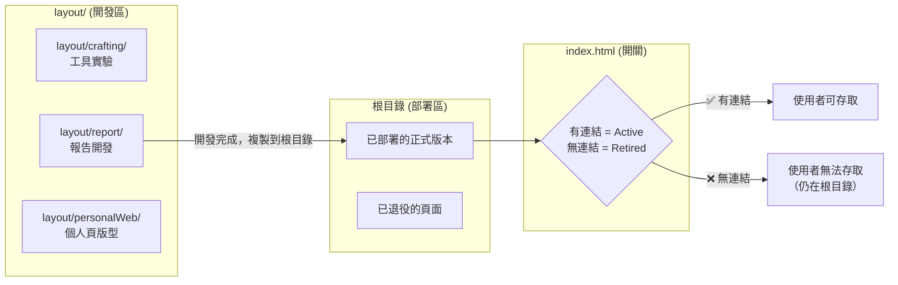

# 📋 Meeting Minutes — 專案架構重構討論 (Round 2)

> **日期**: 2026-03-26 16:06  
> **分支**: `dev/layout-reorganize`  
> **參與者**: King Lin, AI Assistant  
> **狀態**: 🟡 討論中

---

## 🗂️ 議程

1. 釐清根目錄與 `layout/` 的現有工作流
2. 根據 `index.html` 連結重新分類 Deployed / Retired / Draft
3. 修正架構提案方向
4. 待決議題

---

## 📌 會議紀要

### 1. 用戶澄清：現有工作流

> [!IMPORTANT]
> King Lin 澄清了關鍵的工作流程，這改變了原始分析的前提假設。

**原始假設（錯誤）：** 根目錄檔案和 `layout/report/` 是「重複」的混亂狀態。

**實際工作流程：**



**核心邏輯：**
- **`layout/`** = 開發資料夾（類比 `src/` 或 `dev/`）
- **根目錄** = 部署的正式版本（類比 `dist/` 或 `public/`）
- **`index.html`** = 作為「首頁開關」，控制哪些頁面對用戶可見
- 沒在 `index.html` 連結的頁面 = 曾經部署但已「退役」的內容

---

### 2. 重新分類：根據 index.html 連結狀態

#### ✅ Active（有連結，使用者可存取）

| index.html 位置 | 檔案 | 標題 |
|-----------------|------|------|
| Nav → Top50 | `top50/index.html` | Top 50 UX/UI 設計風格 |
| Nav → Apps | `pdf.html` | PDF 工具 |
| Card 1 (2×2) | `2026.html` | 全球數位流量與資訊檢索範式轉移 |
| Card 2 (2×2) | `WebUX.html` | 網站 UX 設計風格與前端技術應用 |
| Card 3 (2×1) | `ebook.html` | 非理性效應：投資的失敗來自本能 |
| Card 4 (2×1) | `human_folly.html` | 人類愚行錄 |
| Card 5 (2×2) | `20260319_mobile_pc.html` | 跨越世代：輕薄本與手機演進史 |
| Card 6 (2×1) | `20260319_automobile.html` | 動力時代的十字路口 |
| Card 7 (1×1) | `20260319_market.html` | 資本市場脈動 |
| Card 8 (1×1) | `20260319_ai.html` | OpenClaw & LLM |
| Card 9 (2×1) | `20260320_StarbucksGame.html` | 台灣咖啡市場競爭動態 |

**共 11 個 Active 頁面**（含 top50 整個資料夾）

#### 🔇 Retired（根目錄存在但無連結，曾經部署過）

| 檔案 | 標題 | 備註 |
|------|------|------|
| `cv.html` | 履歷 | 曾在首頁，後移除 |
| `20260319_zingala.html` | Zingala 分析 | 曾在首頁，後移除 |

#### 🔨 Development（layout/ 開發區）

| 路徑 | 檔案 | 狀態說明 |
|------|------|----------|
| `layout/report/` | 15 個檔案 | 報告開發中 or 根目錄已部署版本的原始稿 |
| `layout/crafting/` | 9 個檔案 | 工具/實驗性開發 |
| `layout/personalWeb/` | 4 個檔案 | 個人網頁版型迭代 |

#### 📄 其他

| 檔案 | 說明 |
|------|------|
| `top50.md` | Top 50 的 markdown 參考文件 |
| `README.md` | 專案說明 |

---

### 3. 修正後的架構思考

基於用戶實際工作流，原始提案需要調整以下重點：

#### 3.1 引入「退役」概念

原始提案中是把 `cv.html` 留在根目錄，把草稿放到 `_drafts/`。但實際上需要一個明確的「退役區」概念：

```
wiskinglin.github.io/
├── index.html                  # 🏠 首頁（入口開關）
│
├── reports/                    # 📝 已部署的報告（Active）
│   ├── 2026.html
│   ├── WebUX.html
│   ├── 20260319_ai.html
│   ├── ...
│   └── human_folly.html
│
├── tools/                      # 🔧 已部署的工具（Active）
│   ├── pdf.html
│   └── ebook.html
│
├── showcase/                   # 🎨 已部署的展示（Active）
│   └── top50/
│
├── _retired/                   # 🔇 曾部署但已退役（不刪除但不連結）
│   ├── cv.html
│   └── 20260319_zingala.html
│
├── _dev/                       # 🔨 開發區（取代 layout/）
│   ├── reports/                # ← layout/report/
│   ├── tools/                  # ← layout/crafting/
│   └── personal/              # ← layout/personalWeb/
│
├── docs/                       # 📚 專案文件 & 討論紀錄
│
└── assets/                     # ⚙️ 共用資源
```

#### 3.2 與原始提案的差異

| 面向 | 原始提案 | 修正方向 |
|------|----------|----------|
| 根目錄角色 | 需要清空，搬到子目錄 | 維持「部署區」概念，但用子目錄分類 |
| 退役內容 | 未考慮 | 新增 `_retired/` 明確放置 |
| `layout/` 角色 | 定位不清要廢除 | 重新命名為 `_dev/`，保持開發區概念 |
| `index.html` 連結 | 搬移後更新路徑 | 搬移後更新路徑（方向一致） |
| 開發 → 部署流程 | 未定義 | 需建立：`_dev/` → 完成後 `git mv` 到正式區 |

---

### 4. 待決議題 (Open Items)

| # | 議題 | 選項 | 建議 |
|---|------|------|------|
| 1 | **退役內容怎麼處理？** | A. 放 `_retired/` 明確標示<br>B. 直接從根目錄刪除<br>C. 保持現狀不動 | A — 明確分類，日後可能重新啟用 |
| 2 | **`layout/report/` 和根目錄的同名檔案？** | A. layout 版本是開發稿，根目錄是部署版<br>B. 根目錄是複製過去的，兩邊一樣 | 需逐一比對確認 |
| 3 | **報告子目錄分類需要嗎？** | A. 用 `reports/tech/`, `reports/market/` 等分類<br>B. 報告全平放在 `reports/` 下<br>C. 先平放，量多再分類 | C — 目前量級（~10個）先平放即可 |
| 4 | **共用資源何時抽取？** | A. 重構時一併處理<br>B. 先搬檔案，後續再抽 | B — 降低重構風險，分步進行 |

---

### 5. 會議結論 & 下一步行動

| # | 行動項目 | 負責人 | 狀態 |
|---|----------|--------|------|
| 1 | 確認上述 4 個待決議題的選項 | King Lin | 🔲 待決 |
| 2 | 比對 `layout/report/` 與根目錄的同名檔案差異 | AI | 🔲 待執行 |
| 3 | 根據決議更新 `project_analysis_and_plan.md` | AI | 🔲 待執行 |
| 4 | 執行 Phase 1：建立新資料夾骨架 | AI | 🔲 待用戶確認後執行 |

---

## 📝 歷次討論紀錄索引

| 日期 | 文件 | 主題 |
|------|------|------|
| 2026-03-26 15:41 | [project_analysis_and_plan.md](./project_analysis_and_plan.md) | 首次完整架構分析 |
| 2026-03-26 15:41 | [2026-03-26_response_summary_v1.md](./2026-03-26_response_summary_v1.md) | 首次回覆摘要備份 |
| 2026-03-26 16:06 | **本文件** | Round 2 討論：釐清工作流 & 修正架構方向 |
