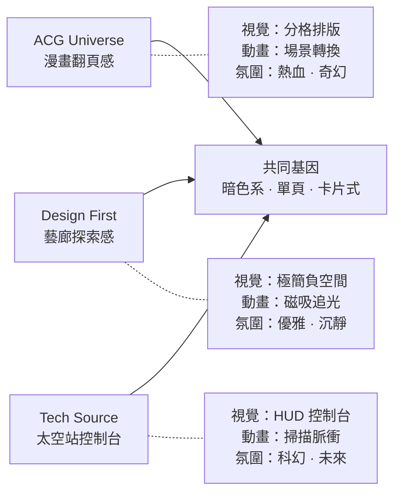

# 📚 Bookmark 沉浸式體驗重新設計提案

> [!IMPORTANT]
> 核心哲學：每個書籤頁面都是一場**獨立的感官體驗**，而非工具型的資料查找介面。
> 使用者不是在「搜尋」——而是在**探索、漫步、發現**。

---

## 設計總覽

| 頁面 | 主題隱喻 | 視覺風格 | 核心動畫體驗 |
|------|---------|---------|------------|
| **ACG Universe** | 翻閱一本從未見過的漫畫 | 漫畫分格 × 賽璐璐色彩 | 滾動翻頁 + 分格動態排版 |
| **Design First** | 走進一間無盡的設計藝廊 | 瑞士極簡 × 磁吸流體 | 游標追蹤 + 磁吸懸浮 + 視差 |
| **Tech Source** | 進入一座科幻太空站的控制台 | HUD 儀表板 × 電路紋理 | 掃描線 + 節點脈衝 + 終端機打字 |

---

## 🎴 ACG Universe — 「翻閱一本從未見過的漫畫」

### 設計概念
將整個頁面想像成一本**巨型漫畫書**。使用者向下滾動就像在翻頁，每個分類就是一個跨頁，每張卡片就是一個漫畫格。

### 視覺語言
- **色彩**：賽璐璐動畫色調——飽和的粉紅、深藍夜空、金色高光
- **排版**：打破均勻網格，模擬漫畫不規則分格 (Manga Panel Layout)
- **裝飾**：對話框元素、速度線、半調網點 (Halftone Dots)、效果線

### 核心動畫體驗

#### 1. 漫畫分格滾動 (Manga Panel Scroll)
```
╔══════════════════════════════════╗
║  ┌─────────────┬────────┐       ║
║  │             │        │       ║
║  │  Nintendo   │ Sony   │       ║
║  │             │        │       ║
║  ├────────┬────┴────────┤       ║
║  │        │             │       ║
║  │ Square │   CAPCOM    │       ║
║  │ Enix   │             │       ║
║  └────────┴─────────────┘       ║
╚══════════════════════════════════╝
```
- 卡片以**不規則的漫畫分格**排列，大小不一
- 滾動時，每一格從邊緣**滑入畫面**，模擬翻頁的動態
- 分類標題以**巨大的日文效果字**呈現，搭配速度線動畫

#### 2. 場景轉換 (Scene Transition)
- 日本區 → 美國區 → 全球區 之間的過渡，使用**全螢幕擦除動畫 (Wipe Transition)**
- 模擬動畫中的場景切換效果
- 背景色調隨分類改變（日本=櫻花粉夜藍 / 美國=星條旗藍紅 / 全球=漸層虹彩）

#### 3. 互動細節
- Hover 卡片時出現**漫畫對話框**效果（氣泡飄出描述文字）
- 點擊連結時觸發**速度線爆炸**動畫，然後跳轉
- 滾動時背景有淡淡的**半調網點 (Halftone)** 圖案隨視差移動
- 每個 Section 的標題有**手寫筆觸**描邊動畫

#### 4. 彩蛋
- 隨機在某張卡片背後藏一個微小的動畫角色剪影
- 當一次性滾動到底部時，觸發一個小小的「完讀」慶祝動畫

---

## 🖼️ Design First — 「走進一間無盡的設計藝廊」

### 設計概念
這是一間**虛擬藝廊**。使用者的滑鼠就是手電筒，照亮作品。每個設計工作室/設計師就是一幅掛在牆上的作品，等待被發現。

### 視覺語言
- **色彩**：純黑背景 + 單一 Accent Color（如純白或亮黃），極致克制
- **排版**：瑞士國際風格 (Swiss Design) — 嚴謹的網格系統 + 超大字體
- **質感**：磨砂玻璃 + 極細線條 + 大量負空間

### 核心動畫體驗

#### 1. 游標追光效果 (Cursor Spotlight)
- 滑鼠移動時，周圍產生一個**柔和的光暈圓圈**
- 光暈範圍內的卡片變得清晰明亮，範圍外的卡片保持暗淡灰階
- 模擬「在暗房中用手電筒發現藝術品」的體驗
- 觸控設備上改為 **scroll-based reveal**（滾動到哪，哪裡亮起）

#### 2. 磁吸懸浮效果 (Magnetic Hover)
- 滑鼠靠近卡片時，卡片會輕微地**被吸引靠向滑鼠**
- 搭配 3D tilt 傾斜效果（CSS perspective + transform）
- 離開時卡片彈回原位，帶有彈性物理效果
- 這是許多頂級設計師作品集常用的手法，與頁面主題完美呼應

#### 3. 視差文字層 (Parallax Typography)
- 每個分類標題以**超大尺寸字體**作為背景裝飾元素
- 滾動時，標題文字與卡片以**不同速度移動**，產生空間感
- 標題數字（1, 2, 3...）以 200px+ 巨型字體顯示在背景

#### 4. 平滑捲動動態 (Smooth Scroll Choreography)
- 導入 `Lenis` 或原生 CSS `scroll-behavior: smooth` 的增強版
- 每張卡片在進入視窗時有精心編排的**交錯出現動畫 (Staggered Reveal)**
- 不是同時出現，而是像多米諾骨牌一樣依序從左到右、從上到下

#### 5. 互動細節
- 卡片間以**極細的連接線**串聯，暗示設計社群的網絡關係
- Hover 時卡片邊緣產生**微光脈衝 (Glow Pulse)**
- 頁面底部的 Footer 文字以**打字機效果**逐字出現

---

## ⚡ Tech Source — 「進入一座科幻太空站的控制台」

### 設計概念
這是一個**科幻風 HUD 控制台介面**。每個品牌就是太空站系統中的一個模組。使用者正在瀏覽的不是書籤——而是一台**太空船的系統面板**。

### 視覺語言
- **色彩**：深黑背景 + 霓虹青色 (#00ffd5) + 琥珀警告色 (#ffb800)
- **排版**：等寬字體 (Monospace) 為主 + 控制台 UI 風格
- **裝飾**：電路板紋路、掃描線、網格座標線、脈衝圓環

### 核心動畫體驗

#### 1. 系統啟動序列 (Boot Sequence)
- 頁面載入時不是直接顯示內容，而是播放一段 2-3 秒的**系統啟動動畫**：
  ```
  > INITIALIZING TECH_SOURCE v2.0...
  > LOADING MODULE: MOBILE ████████░░ 80%
  > LOADING MODULE: LAPTOP ██████████ 100%
  > ALL SYSTEMS ONLINE.
  > WELCOME, OPERATOR.
  ```
- 動畫結束後，內容區以**掃描線從上到下掃過**的方式顯現

#### 2. 電路脈衝背景 (Circuit Pulse Background)
- 背景繪製一層**SVG 電路板紋路**，覆蓋整個頁面
- 分類與分類之間以**脈衝光線**連接（像是電路通電）
- 滾動到新分類時，連接線**亮起**並伴隨微弱的光暈擴散

#### 3. HUD 卡片 (Heads-Up Display Cards)
- 每張品牌卡片帶有**掃描線 (Scanline)** 覆蓋效果
- 卡片四角有**HUD 角標記** (bracket corners `┌ ┐ └ ┘`)
- Hover 時觸發**資料掃描動畫**：邊框亮起 + 社群連結 Tag 逐一以打字效果彈出
- 社群圖示以**霓虹色**呈現（FB=藍 / IG=漸層 / YT=紅），帶有微弱的 glow

#### 4. 分類導航儀表 (Category Dashboard)
- 頁面頂端固定一排**分類 Tab**，風格設計成控制台按鈕
- 切換分類時有**頻道切換**的視覺 glitch 效果
- 當前分類的 Tab 帶有**脈衝呼吸光效**

#### 5. 互動細節
- 品牌名稱以**等寬字體**顯示，hover 時有微弱的**文字閃爍 (Flicker)**
- 社群連結 Tag 的背景有微微的**掃描線動畫**循環
- 滾動時，頁面右下角顯示一個小型**座標指示器** `[SECTOR 3/7]`
- 每個分類的 Emoji 圖示替換為**霓虹風格的自訂 SVG 圖示**

---

## 🔧 技術實現方案

### 純前端實現 (Zero Dependencies 策略)
所有動畫效果皆可透過以下原生技術實現，無需額外框架：

| 技術 | 用途 |
|------|-----|
| CSS Custom Properties | 主題切換、動態色彩 |
| CSS `@keyframes` | 循環動畫（脈衝、掃描線、呼吸光效） |
| CSS `backdrop-filter` | 毛玻璃效果 |
| `Intersection Observer` | 滾動觸發動畫 |
| `mousemove` event | 游標追蹤（光暈、磁吸） |
| CSS `perspective` + `transform` | 3D 傾斜效果 |
| SVG `<pattern>` | 電路紋路、網點圖案 |
| `requestAnimationFrame` | 平滑動畫計算 |

### 每頁獨立風格的 CSS 變數

```css
/* ACG — 賽璐璐 */
:root { --accent: #f43f5e; --bg: #0a0a1a; --panel-border: 3px solid; }

/* Design First — 藝廊 */
:root { --accent: #fbbf24; --bg: #000000; --card-opacity: 0.3; }

/* Tech Source — HUD */
:root { --accent: #00ffd5; --bg: #050508; --font-mono: 'JetBrains Mono'; }
```

---

## 📋 建議的分階段實作計畫

### Stage 1: Design First 重製 ⭐ (建議先做)
**原因**：此頁面的「磁吸 + 追光」效果最能直接展現設計品味，也是技術上最容易驗證的。
- 實作 Cursor Spotlight
- 實作 Magnetic Hover + 3D Tilt
- 實作 Staggered Scroll Reveal
- 大字體視差背景

### Stage 2: Tech Source 重製
- 實作 Boot Sequence 開機動畫
- 實作 HUD 卡片風格
- 實作電路脈衝背景 SVG
- 分類 Tab 導航 + Glitch 切換

### Stage 3: ACG Universe 重製
- 實作漫畫分格不規則排版
- 實作場景轉換 Wipe 動畫
- 實作對話框 Hover 效果
- 半調網點背景 + 速度線

### Stage 4: 共通優化
- 修正返回首頁的路徑 Bug (`../../` → `../`)
- 修正 LocalStorage 主題 Key 衝突
- 響應式與觸控設備降級方案
- 效能優化 (will-change, GPU 加速)

---

## 🎯 核心體驗差異化總結



> [!TIP]
> 三個頁面共享「暗色基底 + 卡片式連結」的 DNA，但透過截然不同的**視覺語言、動畫節奏、氛圍營造**，讓每次點進不同頁面都像走進一個全新的世界。

---
---

# 📚 v2 — 修訂版提案（2026-04-22）

> [!NOTE]
> **v1 → v2 關鍵變更**
> 1. 互動模型從「複雜互動（磁吸/追光/Boot Sequence）」簡化為**「滑 IG」式垂直捲動**
> 2. 每頁新增**三種配色主題**，參照 `reader.html` 的 light / sepia / dark 切換模式
> 3. 所有動畫以「滾動觸發 + CSS transition」為核心，不再依賴複雜的 mousemove 計算
> 4. 確保 PC（由上往下滑）與手機（由下往上滑）的閱讀體驗一致且流暢

---

## 核心互動模型：「滑 IG」垂直信息流

### 設計哲學

使用者瀏覽書籤的方式應該像**滑 Instagram Stories / Reels** 一樣自然：

- 📱 **手機**：拇指由下往上滑，一張卡片接一張卡片地「刷過」
- 💻 **PC**：滑鼠滾輪由上往下滾，同樣的節奏感

不需要點擊分類、不需要搜尋、不需要複雜的游標互動——**單指/單手就能完成所有探索**。

### 佈局架構

```
┌──────────────────────────────────┐
│  ▓ 固定頂部 Nav（Logo + 主題切換）│
├──────────────────────────────────┤
│                                  │
│  ┌────────────────────────────┐  │
│  │   📂 分類標題 (全寬)       │  │  ← Section Divider Card
│  │   「🇯🇵 日本 — 遊戲設計」   │  │     獨立的一張「封面卡」
│  └────────────────────────────┘  │
│                                  │
│  ┌────────────────────────────┐  │
│  │   Nintendo (任天堂)        │  │  ← Item Card
│  │   全球遊戲產業領導者...     │  │     每個書籤一張卡
│  │   [Visit Official →]      │  │
│  └────────────────────────────┘  │
│                                  │
│  ┌────────────────────────────┐  │
│  │   Sony Interactive...      │  │  ← 下一張卡
│  │   PlayStation 品牌擁有者... │  │
│  │   [Visit Official →]      │  │
│  └────────────────────────────┘  │
│                                  │
│          ⋮ (繼續往下滑)          │
│                                  │
├──────────────────────────────────┤
│  ▓ 固定底部指示器（進度 / 分類名）│
└──────────────────────────────────┘
```

### 核心機制

#### 1. 垂直信息流 (Vertical Feed)
- 每個書籤項目是一張**全寬卡片**（手機滿版、PC 以 `max-width: 680px` 置中）
- 每個分類以一張**封面卡 (Section Divider)** 作為視覺分隔——大字標題、主題色背景、裝飾動畫
- 卡片之間有適當間距（`gap: 16px`），不使用 scroll-snap（避免強制定位造成不自然感）

#### 2. 滾動觸發動畫 (Scroll-Driven Animation)
- 每張卡片在進入視窗時，觸發一次性的**淡入 + 微滑入**動畫
- 使用 `Intersection Observer`，`threshold: 0.15`
- 動畫極為克制：`opacity: 0 → 1` + `translateY(24px) → 0`，時長 `0.4s`
- 封面卡的進場動畫可以稍微誇張一些（加入 scale 或裝飾元素的展開）

#### 3. 底部進度指示 (Progress Indicator)
- 固定在頁面底部中央，顯示當前所在的**分類名稱**
- 當滾動進入新分類時，底部指示器以**淡入切換**更新文字
- 同時可顯示輕量的進度比例（如 `3/9 sections`）
- 參照 `reader.html` 的 `chapter-indicator` 設計模式

---

## 三種配色主題系統

> [!IMPORTANT]
> 參照 `reader.html` 的 `theme-light` / `theme-sepia` / `theme-dark` 三主題架構，
> 但每個書籤頁面的三套配色都是**為該頁面主題量身訂製**的，而非共用同一套。

### 主題切換 UI

沿用 `reader.html` 的三顆圓形按鈕設計，放在頂部 Nav 的右側：

```html
<!-- 三顆主題切換圓鈕 -->
<div class="flex space-x-1">
  <button onclick="setTheme('default')" class="w-8 h-8 rounded-full ..." title="預設">
    <i class="fas fa-circle"></i>
  </button>
  <button onclick="setTheme('alt')" class="w-8 h-8 rounded-full ..." title="變體">
    <i class="fas fa-circle"></i>
  </button>
  <button onclick="setTheme('contrast')" class="w-8 h-8 rounded-full ..." title="對比">
    <i class="fas fa-circle"></i>
  </button>
</div>
```

主題偏好儲存至 `localStorage`，使用各頁獨立的 key（`acg-theme` / `df-theme` / `ts-theme`）。

### 🎴 ACG Universe — 三種配色

| 主題 | 名稱 | 背景 | 卡片 | 強調色 | 氛圍 |
|------|------|------|------|--------|------|
| **Default** | 🌙 深夜動畫 | `#0a0a1a` 深夜藍黑 | `#161629` 半透明 | `#f43f5e` 玫瑰紅 | 深夜追番的沉浸感 |
| **Alt** | 🌸 賽璐璐 | `#fff5f5` 淡櫻花白 | `#ffffff` 純白 | `#e11d48` 熱情紅 | 翻閱實體漫畫的明亮清爽 |
| **Contrast** | ⚡ 電競霓虹 | `#050505` 純黑 | `#0f0f0f` 碳黑 | `#00ff88` 霓虹綠 | 遊戲 HUD 的電競氛圍 |

```css
/* ACG — Default: 深夜動畫 */
.theme-default {
  --bg-primary: #0a0a1a;
  --bg-card: #161629;
  --text-primary: #f0e6ff;
  --text-secondary: #8b7faa;
  --accent: #f43f5e;
  --divider-bg: linear-gradient(135deg, #1a0a2e, #2d1b4e);
}

/* ACG — Alt: 賽璐璐 */
.theme-alt {
  --bg-primary: #fff5f5;
  --bg-card: #ffffff;
  --text-primary: #1a1a2e;
  --text-secondary: #6b7280;
  --accent: #e11d48;
  --divider-bg: linear-gradient(135deg, #fce7f3, #fecdd3);
}

/* ACG — Contrast: 電競霓虹 */
.theme-contrast {
  --bg-primary: #050505;
  --bg-card: #0f0f0f;
  --text-primary: #00ff88;
  --text-secondary: #007744;
  --accent: #00ff88;
  --divider-bg: linear-gradient(135deg, #001a0d, #002211);
}
```

### 🖼️ Design First — 三種配色

| 主題 | 名稱 | 背景 | 卡片 | 強調色 | 氛圍 |
|------|------|------|------|--------|------|
| **Default** | 🖤 暗室藝廊 | `#000000` 純黑 | `rgba(17,17,17,0.6)` 玻璃 | `#6366f1` 靛青紫 | 高端藝廊的深邃感 |
| **Alt** | 📜 瑞士印刷 | `#f4ecd8` 米黃紙 | `#ede4cf` 舊紙 | `#1a1a1a` 墨黑 | 翻閱 Helvetica 字體冊的溫潤 |
| **Contrast** | 🌕 極致白 | `#fafafa` 月光白 | `#ffffff` 純白 | `#f59e0b` 琥珀金 | 現代美術館的開放空間 |

```css
/* DF — Default: 暗室藝廊 */
.theme-default {
  --bg-primary: #000000;
  --bg-card: rgba(17, 17, 17, 0.6);
  --text-primary: #ffffff;
  --text-secondary: #6b7280;
  --accent: #6366f1;
  --divider-bg: linear-gradient(135deg, #0a0a1f, #1a1a3e);
}

/* DF — Alt: 瑞士印刷 */
.theme-alt {
  --bg-primary: #f4ecd8;
  --bg-card: #ede4cf;
  --text-primary: #1a1a1a;
  --text-secondary: #5b4636;
  --accent: #1a1a1a;
  --divider-bg: linear-gradient(135deg, #e8dcc6, #d4c5ab);
}

/* DF — Contrast: 極致白 */
.theme-contrast {
  --bg-primary: #fafafa;
  --bg-card: #ffffff;
  --text-primary: #0a0a0a;
  --text-secondary: #9ca3af;
  --accent: #f59e0b;
  --divider-bg: linear-gradient(135deg, #fffbeb, #fef3c7);
}
```

### ⚡ Tech Source — 三種配色

| 主題 | 名稱 | 背景 | 卡片 | 強調色 | 氛圍 |
|------|------|------|------|--------|------|
| **Default** | 🛰️ 太空站 | `#050508` 深空黑 | `#0d0d12` 鋼灰 | `#00ffd5` 霓虹青 | 科幻控制台 |
| **Alt** | 🔧 工業灰 | `#f5f5f5` 淺灰白 | `#ffffff` 純白 | `#3b82f6` 科技藍 | 白天辦公室的清晰閱讀 |
| **Contrast** | 🟡 琥珀終端 | `#0a0800` 深棕黑 | `#121008` 暗琥珀 | `#ffb800` 琥珀黃 | 復古終端機 / 老式 CRT |

```css
/* TS — Default: 太空站 */
.theme-default {
  --bg-primary: #050508;
  --bg-card: #0d0d12;
  --text-primary: #e0f2fe;
  --text-secondary: #64748b;
  --accent: #00ffd5;
  --divider-bg: linear-gradient(135deg, #001a1a, #002626);
}

/* TS — Alt: 工業灰 */
.theme-alt {
  --bg-primary: #f5f5f5;
  --bg-card: #ffffff;
  --text-primary: #1e293b;
  --text-secondary: #64748b;
  --accent: #3b82f6;
  --divider-bg: linear-gradient(135deg, #dbeafe, #bfdbfe);
}

/* TS — Contrast: 琥珀終端 */
.theme-contrast {
  --bg-primary: #0a0800;
  --bg-card: #121008;
  --text-primary: #ffd000;
  --text-secondary: #a68b00;
  --accent: #ffb800;
  --divider-bg: linear-gradient(135deg, #1a1400, #2a2000);
}
```

---

## 各頁面的差異化視覺設計（v2 簡化版）

> [!TIP]
> v2 保留 v1 的三種主題隱喻（漫畫 / 藝廊 / 控制台），但將所有互動簡化為**滾動驅動**。
> 複雜的游標追蹤、磁吸、Boot Sequence 等 PC-only 效果已移除，
> 改以**卡片設計差異化 + 封面卡裝飾動畫 + 背景紋理**來建立氛圍。

### 🎴 ACG Universe — 差異化元素

#### 卡片設計
- 卡片左側有一條 **3px 粗邊** (漫畫分格線感)
- 標題使用粗體 + 行高緊湊，模擬漫畫對白的排版張力
- 描述文字使用較小字體 + 較高行高，模擬旁白敘述

#### 封面卡 (Section Divider)
- 全寬、高度 `60vh`，使用**漸層背景**
- 分類名稱以**超大字體（手機 48px / PC 72px）**居中
- 背景有淡淡的**半調網點 (CSS radial-gradient halftone)** 動畫
- 進場時標題從下方滑入 + 淡出背景裝飾線展開

#### 背景紋理
- 整頁背景覆蓋一層**半調網點 (Halftone Dots)** SVG 圖案
- 極低透明度 (`opacity: 0.03`)，不影響閱讀但增添漫畫質感

```css
/* 半調網點背景 */
.acg-halftone {
  background-image: radial-gradient(circle, var(--accent) 1px, transparent 1px);
  background-size: 20px 20px;
  opacity: 0.03;
  position: fixed;
  inset: 0;
  pointer-events: none;
}
```

### 🖼️ Design First — 差異化元素

#### 卡片設計
- 卡片完全**無邊框**，僅靠微妙的背景色差區隔
- 大量**負空間** (padding 加大)
- 標題使用 `Space Grotesk` 字體，描述用 `Inter Light`
- Hover 時卡片有極細的 `1px` 邊框淡入

#### 封面卡 (Section Divider)
- 分類名稱以**超大、極輕字重 (font-weight: 200)** 顯示
- 編號數字 (01, 02, 03...) 以 **120px+ 超大尺寸**放在背景，低透明度
- 整體感覺像是美術館中的展區標示牌

#### 背景紋理
- 無紋理，**純色背景**
- 唯一的裝飾是一個**極淡的漸層光暈** blob，模擬藝廊中的聚光燈餘暉

```css
/* 藝廊聚光燈餘暉 */
.df-spotlight {
  background: radial-gradient(
    ellipse at 50% 30%, 
    var(--accent) 0%, 
    transparent 70%
  );
  opacity: 0.06;
  position: fixed;
  inset: 0;
  pointer-events: none;
}
```

### ⚡ Tech Source — 差異化元素

#### 卡片設計
- 卡片四角有 **HUD 角標 (Corner Brackets)** — 用 CSS `::before` / `::after` 繪製
- 文字使用 **等寬字體** (`JetBrains Mono` 或 `SF Mono`)
- 社群連結顯示為像終端機 tag 的小方塊
- 卡片有微弱的 **掃描線覆蓋** (CSS repeating-linear-gradient)

#### 封面卡 (Section Divider)
- 分類名稱前綴 `> ` 或 `$` 符號，模擬終端機提示符
- 標題文字帶有 **打字機逐字出現動畫** (每張封面卡進場時播放一次)
- 背景有微弱的 **網格座標線**

#### 背景紋理
- 整頁背景覆蓋一層**極淡的網格線** (grid pattern)
- 加上**微弱的掃描線** (scanline) 覆蓋

```css
/* HUD 網格背景 */
.ts-grid {
  background-image: 
    linear-gradient(var(--accent) 1px, transparent 1px),
    linear-gradient(90deg, var(--accent) 1px, transparent 1px);
  background-size: 60px 60px;
  opacity: 0.02;
  position: fixed;
  inset: 0;
  pointer-events: none;
}

/* 掃描線覆蓋 */
.ts-scanline {
  background: repeating-linear-gradient(
    0deg,
    transparent,
    transparent 2px,
    rgba(0, 0, 0, 0.03) 2px,
    rgba(0, 0, 0, 0.03) 4px
  );
  position: fixed;
  inset: 0;
  pointer-events: none;
}

/* HUD 角標 */
.hud-card::before,
.hud-card::after {
  content: '';
  position: absolute;
  width: 12px;
  height: 12px;
  border-color: var(--accent);
  opacity: 0.4;
}
.hud-card::before {
  top: 0; left: 0;
  border-top: 2px solid;
  border-left: 2px solid;
}
.hud-card::after {
  bottom: 0; right: 0;
  border-bottom: 2px solid;
  border-right: 2px solid;
}
```

---

## 修訂版實作計畫

### Stage 1: Design First 重製 ⭐

**目標**：以「滑 IG」信息流 + 三種配色完成 Design First 頁面重製。

| 項目 | 細節 |
|------|------|
| 佈局 | 單欄垂直信息流，`max-width: 680px` 置中 |
| 卡片 | 無邊框、大 padding、極簡風格 |
| 封面卡 | 超大輕字重標題 + 背景大數字 |
| 主題 | 暗室藝廊 / 瑞士印刷 / 極致白 |
| 動畫 | Intersection Observer 淡入 + spotlight 背景 |
| Bug 修復 | 修正路徑 `../../` → `../`、localStorage key 獨立 |

### Stage 2: Tech Source 重製

| 項目 | 細節 |
|------|------|
| 佈局 | 單欄信息流 + 等寬字體 |
| 卡片 | HUD 角標 + 掃描線覆蓋 + 社群 Tag |
| 封面卡 | 終端機提示符 `>` + 打字動畫 |
| 主題 | 太空站 / 工業灰 / 琥珀終端 |
| 動畫 | Intersection Observer + 封面卡打字效果 |
| 背景 | 網格線 + 掃描線 |

### Stage 3: ACG Universe 重製

| 項目 | 細節 |
|------|------|
| 佈局 | 單欄信息流 + 粗邊分格線 |
| 卡片 | 左側粗邊框 + 緊湊標題排版 |
| 封面卡 | 超大標題 + 半調網點 + 漸層背景 |
| 主題 | 深夜動畫 / 賽璐璐 / 電競霓虹 |
| 動畫 | Intersection Observer + 封面卡裝飾展開 |
| 背景 | 半調網點 SVG |

### Stage 4: 共通優化

- 三頁共用的 `setTheme()` / `openUrl()` 邏輯統一
- 響應式測試（iPhone SE / iPhone Pro / iPad / Desktop）
- `prefers-reduced-motion` 無障礙降級
- 觸控設備的 hover 替代方案

---

## v1 → v2 變更摘要

| 維度 | v1 | v2 |
|------|----|----|
| **互動模型** | 游標追蹤、磁吸、Boot Sequence | 純滾動 (滑 IG) |
| **佈局** | 三欄網格 | 單欄信息流 |
| **配色** | 每頁 2-3 種（不統一） | 每頁 3 種，參照 reader.html 模式 |
| **動畫觸發** | mousemove + 頁面載入 | Intersection Observer (scroll) |
| **裝置適配** | PC 優先，手機降級 | **手機優先，PC 增強** |
| **複雜度** | 高（物理模擬、RAF 計算） | 低（CSS transitions + IO） |
| **差異化方式** | 互動行為不同 | **卡片風格 + 封面卡 + 背景紋理**不同 |
