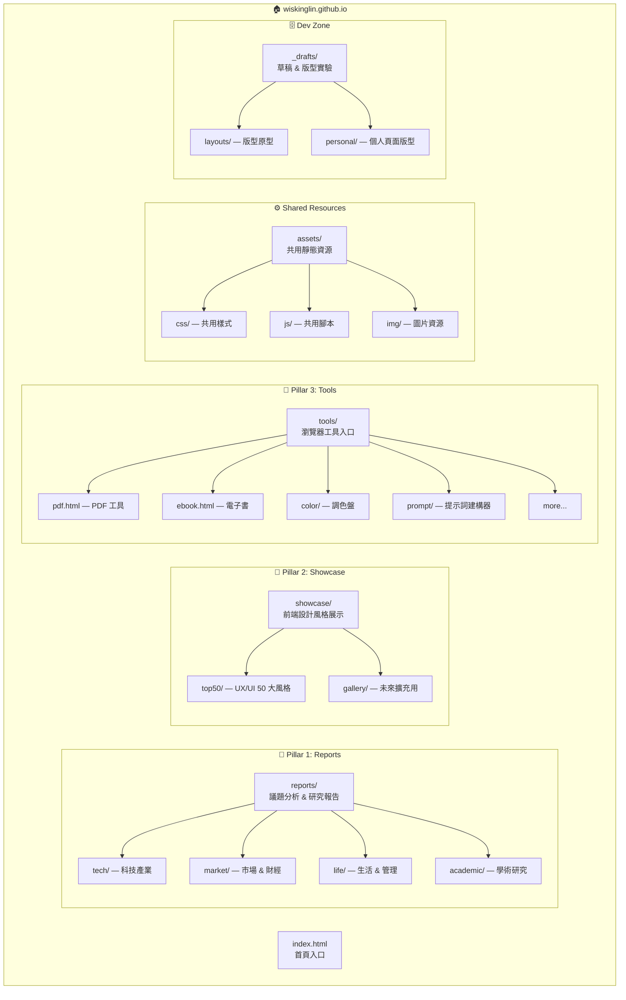
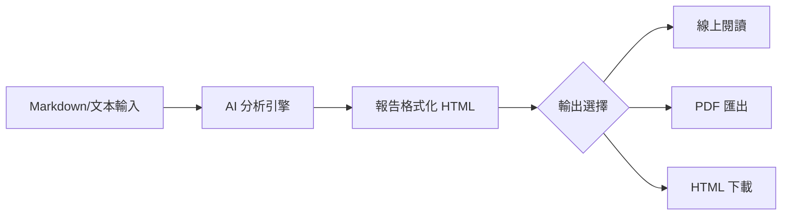

# 🏗️ wiskinglin.github.io 專案架構分析與重構規劃

> **分支**: `dev/layout-reorganize` | **分析日期**: 2026-03-26

---

## 📊 一、現況分析

### 1.1 目前目錄結構

```
wiskinglin.github.io/
├── .agents/                        # AI Agent 配置
│   ├── skills/
│   └── workflows/
├── layout/                         # ⚠️ 未分類的版型開發區
│   ├── crafting/                   # 工具/實驗性 HTML（9 個檔案）
│   ├── personalWeb/                # 個人網頁版型（4 個檔案）
│   └── report/                     # 報告版型（15 個檔案）
├── top50/                          # ✅ Top 50 UX/UI 設計風格展示（51 個檔案）
├── index.html                      # 首頁 Bento Grid
├── 2026.html                       # 📝 報告：全球數位流量趨勢
├── 20260319_ai.html                # 📝 報告：AI 狂潮分析
├── 20260319_automobile.html        # 📝 報告：汽車產業分析
├── 20260319_market.html            # 📝 報告：資本市場脈動
├── 20260319_mobile_pc.html         # 📝 報告：3C 產品線分析
├── 20260319_zingala.html           # 📝 報告：Zingala 分析
├── 20260320_StarbucksGame.html     # 📝 報告：星巴克賽局分析
├── WebUX.html                      # 📝 報告：Web UX 設計風格報告
├── human_folly.html                # 📝 報告：人類愚行錄
├── cv.html                         # 📝 報告/個人：履歷
├── ebook.html                      # 🔧 工具：電子書閱讀器
├── pdf.html                        # 🔧 工具：PDF 工具
├── top50.md                        # 📄 Top 50 相關文件
└── README.md
```

### 1.2 問題診斷

| 問題 | 嚴重度 | 說明 |
|------|--------|------|
| **根目錄混亂** | 🔴 高 | 9 個報告類 HTML 直接放在根目錄，隨著內容增加將難以維護 |
| **layout 目錄定位模糊** | 🟡 中 | `layout/` 同時包含「半成品版型」和「可上線頁面」，角色不清 |
| **重複檔案** | 🟡 中 | 根目錄與 `layout/report/` 存在同名檔案（如 `2026.html`、`WebUX.html`、`human_folly.html`、`StarbucksGame.html`） |
| **工具類散落** | 🟡 中 | `ebook.html`、`pdf.html` 在根目錄；`crafting/` 下有更多工具類實驗作品，無統一入口 |
| **無共用資源** | 🟠 低 | 無共用 CSS/JS 資料夾，每個 HTML 各自引用 CDN，未來維護成本高 |
| **命名規範不一** | 🟠 低 | 混用日期前綴（`20260319_`）、CamelCase（`StarbucksGame`）、底線分隔（`human_folly`） |

### 1.3 檔案分類清單

#### 📝 報告類 (Reports) — 議題分析 + 可編輯/可輸出 HTML/PDF

| 目前路徑 | 標題 | 來源/備份 |
|----------|------|-----------|
| `/2026.html` | 全球數位流量與資訊檢索範式轉移 | `layout/report/2026.html` |
| `/WebUX.html` | 2025-2026 年網站 UX 設計風格報告 | `layout/report/WebUX.html` |
| `/20260319_ai.html` | OpenClaw & LLM — AI 革命 | — |
| `/20260319_automobile.html` | 動力時代的十字路口 | — |
| `/20260319_market.html` | 資本市場脈動 | — |
| `/20260319_mobile_pc.html` | 跨越世代的極致工藝 | — |
| `/20260319_zingala.html` | Zingala 分析 | — |
| `/20260320_StarbucksGame.html` | 台灣咖啡市場競爭動態 | `layout/report/StarbucksGame.html` |
| `/human_folly.html` | 人類愚行錄 | `layout/report/human_folly.html` |
| `/cv.html` | 履歷 (CV) | — |
| `layout/report/Ateam.html` | 頂尖產品團隊協作矩陣 v1 | — |
| `layout/report/Ateam_v2.html` | 頂尖產品團隊協作矩陣 v2 | — |
| `layout/report/2026CreditCard_JPTrip.html` | 2026 信用卡優化與富士山企劃 | — |
| `layout/report/2026TaiwanCars.html` | 台灣汽車市場日系品牌戰略 | — |
| `layout/report/2026TaiwanCars-Edit.html` | 台灣汽車市場日系品牌（編輯版） | — |
| `layout/report/A4_*.html` (×3) | 學術/研究報告 | — |
| `layout/report/CokeGame.html` | 可口可樂與百事可樂博弈 | — |
| `layout/report/Family711CafeGame.html` | 超商咖啡市場競爭動態 | — |
| `layout/report/MidLevelChallenger.html` | 中階主管培育方案 | — |

#### 🔧 工具類 (Tools) — 瀏覽器功能工具

| 目前路徑 | 標題 | 用途 |
|----------|------|------|
| `/ebook.html` | 非理性效應電子書 | eBook 閱讀器 |
| `/pdf.html` | PDF 工具 | PDF 檢視/輸出 |
| `layout/crafting/PromptMagician.html` | Prompt Architect | AI 提示詞建構器 |
| `layout/crafting/MobileTest.html` | 萌萌裝置測試儀 | 行動裝置測試 |
| `layout/crafting/LiveFlow.html` | 專業狀態機流程圖 | 流程圖工具 |
| `layout/crafting/color*.html` (×3) | Chroma OS 調色盤 | 色彩工具 |
| `layout/crafting/50jp.html` | 五十音學習助手 | 語言學習工具 |
| `layout/crafting/ebook.html` | 非理性效應電子書（原版） | eBook 閱讀器原型 |

#### 🎨 展示類 (Showcase) — 前端設計風格展示

| 目前路徑 | 說明 |
|----------|------|
| `/top50/` (01-50.html + index.html) | Top 50 UX/UI 設計風格互動範例 |
| `layout/crafting/vibe.html` | 2026 Web Trends Top 50 早期版本 |

#### 🧑‍💻 個人網頁版型 (Personal Web Layouts)

| 目前路徑 | 標題 |
|----------|------|
| `layout/personalWeb/About_v1.html` | 關於我 v1 |
| `layout/personalWeb/About_v2.html` | 關於我 v2 |
| `layout/personalWeb/Projects.html` | 專案列表 |
| `layout/personalWeb/mockup.html` | Mockup Insights Feed |

---

## 🎯 二、網站三大支柱與目標架構

根據你的三大方向，定義出清晰的目錄結構：



### 2.1 提案目錄結構

```
wiskinglin.github.io/
│
├── index.html                          # 🏠 首頁（Bento Grid 入口）
├── cv.html                             # 👤 履歷（保留根目錄便於分享）
├── README.md
│
├── reports/                            # 📝 Pillar 1：研究報告 & 議題分析
│   ├── index.html                      # 報告總覽頁（未來新增）
│   ├── tech/                           # 科技與產品
│   │   ├── 2026-web-traffic.html       # ← 2026.html
│   │   ├── 2026-web-ux.html            # ← WebUX.html
│   │   ├── 2026-ai-revolution.html     # ← 20260319_ai.html
│   │   └── 2026-mobile-pc.html         # ← 20260319_mobile_pc.html
│   ├── market/                         # 市場 & 財經
│   │   ├── 2026-market-watch.html      # ← 20260319_market.html
│   │   ├── 2026-automobile.html        # ← 20260319_automobile.html
│   │   ├── 2026-taiwan-cars.html       # ← layout/report/2026TaiwanCars.html
│   │   ├── 2026-zingala.html           # ← 20260319_zingala.html
│   │   └── 2026-creditcard-jp.html     # ← layout/report/2026CreditCard_JPTrip.html
│   ├── business/                       # 商業策略 & 賽局
│   │   ├── starbucks-game.html         # ← 20260320_StarbucksGame.html
│   │   ├── coke-game.html              # ← layout/report/CokeGame.html
│   │   ├── 711-cafe-game.html          # ← layout/report/Family711CafeGame.html
│   │   └── a-team.html                 # ← layout/report/Ateam_v2.html
│   ├── life/                           # 生活、心理、管理
│   │   ├── human-folly.html            # ← human_folly.html
│   │   ├── ebook-irrational.html       # ← ebook.html（報告版，非工具）
│   │   └── mid-level-challenger.html   # ← layout/report/MidLevelChallenger.html
│   └── academic/                       # 學術研究報告
│       ├── bricolage-emotions.html     # ← layout/report/A4_Effect of Bricolage...
│       ├── google-apple-ux.html        # ← layout/report/A4_GoogleApple_UX.html
│       └── precision-medicine.html     # ← layout/report/A4_精準診斷至精準治療.html
│
├── showcase/                           # 🎨 Pillar 2：前端設計風格展示
│   ├── index.html                      # 展示總覽頁（未來新增）
│   └── top50/                          # ← 現有 top50/ 整體遷移
│       ├── index.html
│       ├── 01.html ~ 50.html
│       └── ...
│
├── tools/                              # 🔧 Pillar 3：瀏覽器工具集
│   ├── index.html                      # 工具總覽頁（未來新增）
│   ├── pdf.html                        # ← pdf.html
│   ├── ebook.html                      # ← ebook.html（閱讀器工具版）
│   ├── prompt-architect.html           # ← layout/crafting/PromptMagician.html
│   ├── mobile-test.html                # ← layout/crafting/MobileTest.html
│   ├── live-flow.html                  # ← layout/crafting/LiveFlow.html
│   ├── chroma-color.html              # ← layout/crafting/colorV3.html (最新版)
│   └── japanese-50on.html              # ← layout/crafting/50jp.html
│
├── assets/                             # ⚙️ 共用靜態資源
│   ├── css/
│   │   └── global.css                  # 全站共用基礎樣式
│   ├── js/
│   │   └── common.js                   # 全站共用腳本
│   └── img/                            # 共用圖片
│
├── _drafts/                            # 🗄️ 草稿 & 版型實驗區（不部署/或 .gitignore）
│   ├── layouts/                        # ← layout/crafting/ 舊版本
│   │   ├── color-v1.html
│   │   ├── color-v2.html
│   │   ├── ebook-draft.html
│   │   └── vibe.html
│   ├── personal/                       # ← layout/personalWeb/
│   │   ├── about-v1.html
│   │   ├── about-v2.html
│   │   ├── projects.html
│   │   └── mockup.html
│   └── reports/                        # 報告舊版本
│       ├── ateam-v1.html
│       └── taiwan-cars-edit.html
│
└── .agents/                            # AI Agent 配置（不變）
    ├── skills/
    └── workflows/
```

---

## 📋 三、重構執行計畫

### Phase 0：準備工作 `[優先]`
- [ ] 確認目前 `dev/layout-reorganize` 分支所有變更已 commit
- [ ] 建立 `.gitignore` 排除 `_drafts/` (如不想部署草稿)
- [ ] 建立 `assets/css/global.css` 共用樣式基礎

### Phase 1：建立新資料夾骨架 `[Day 1]`
- [ ] 建立 `reports/` 及其子目錄 `tech/`, `market/`, `business/`, `life/`, `academic/`
- [ ] 建立 `showcase/`
- [ ] 建立 `tools/`
- [ ] 建立 `assets/css/`, `assets/js/`, `assets/img/`
- [ ] 建立 `_drafts/layouts/`, `_drafts/personal/`, `_drafts/reports/`

### Phase 2：搬移報告類檔案 `[Day 1-2]`

> [!IMPORTANT]
> 搬移時需同步更新 `index.html` 中所有 `<a href="...">` 連結路徑！

| 動作 | 來源 | 目標 |
|------|------|------|
| `git mv` | `2026.html` | `reports/tech/2026-web-traffic.html` |
| `git mv` | `WebUX.html` | `reports/tech/2026-web-ux.html` |
| `git mv` | `20260319_ai.html` | `reports/tech/2026-ai-revolution.html` |
| `git mv` | `20260319_mobile_pc.html` | `reports/tech/2026-mobile-pc.html` |
| `git mv` | `20260319_market.html` | `reports/market/2026-market-watch.html` |
| `git mv` | `20260319_automobile.html` | `reports/market/2026-automobile.html` |
| `git mv` | `20260319_zingala.html` | `reports/market/2026-zingala.html` |
| `git mv` | `20260320_StarbucksGame.html` | `reports/business/starbucks-game.html` |
| `git mv` | `human_folly.html` | `reports/life/human-folly.html` |
| `git mv` | `layout/report/Ateam_v2.html` | `reports/business/a-team.html` |
| `git mv` | `layout/report/CokeGame.html` | `reports/business/coke-game.html` |
| `git mv` | `layout/report/Family711CafeGame.html` | `reports/business/711-cafe-game.html` |
| `git mv` | `layout/report/MidLevelChallenger.html` | `reports/life/mid-level-challenger.html` |
| `git mv` | `layout/report/2026CreditCard_JPTrip.html` | `reports/market/2026-creditcard-jp.html` |
| `git mv` | `layout/report/2026TaiwanCars.html` | `reports/market/2026-taiwan-cars.html` |
| `git mv` | `layout/report/A4_*.html` (×3) | `reports/academic/` |

### Phase 3：搬移工具類檔案 `[Day 2]`

| 動作 | 來源 | 目標 |
|------|------|------|
| `git mv` | `pdf.html` | `tools/pdf.html` |
| `git mv` | `ebook.html` | `tools/ebook.html` |
| `git mv` | `layout/crafting/PromptMagician.html` | `tools/prompt-architect.html` |
| `git mv` | `layout/crafting/MobileTest.html` | `tools/mobile-test.html` |
| `git mv` | `layout/crafting/LiveFlow.html` | `tools/live-flow.html` |
| `git mv` | `layout/crafting/colorV3.html` | `tools/chroma-color.html` |
| `git mv` | `layout/crafting/50jp.html` | `tools/japanese-50on.html` |

### Phase 4：搬移展示類 & 草稿 `[Day 2-3]`

| 動作 | 來源 | 目標 |
|------|------|------|
| `git mv` | `top50/` | `showcase/top50/` |
| `git mv` | `layout/personalWeb/*` | `_drafts/personal/` |
| `git mv` | `layout/crafting/vibe.html` | `_drafts/layouts/` |
| `git mv` | `layout/crafting/color.html` | `_drafts/layouts/color-v1.html` |
| `git mv` | `layout/crafting/colorV2.html` | `_drafts/layouts/color-v2.html` |
| `git mv` | `layout/crafting/ebook.html` | `_drafts/layouts/ebook-draft.html` |
| `git mv` | `layout/report/Ateam.html` | `_drafts/reports/ateam-v1.html` |
| `git mv` | `layout/report/2026TaiwanCars-Edit.html` | `_drafts/reports/taiwan-cars-edit.html` |
| 清理重複 | `layout/report/` 與根目錄重複檔案 | 保留一方，刪除重複 |

### Phase 5：更新路由 & 導覽 `[Day 3]`
- [ ] 更新 `index.html` 所有 `<a href>` 指向新路徑
- [ ] 更新 `top50/index.html` 內部連結
- [ ] 建立 `reports/index.html` — 報告總覽入口頁
- [ ] 建立 `tools/index.html` — 工具總覽入口頁
- [ ] 建立 `showcase/index.html` — 展示總覽入口頁
- [ ] 更新首頁導覽列增加三大區塊入口

### Phase 6：建立共用樣式基礎 `[Day 4]`
- [ ] 抽取共用 CSS 變數（顏色、字型、間距）到 `assets/css/global.css`
- [ ] 抽取共用導覽列元件到 `assets/js/common.js`
- [ ] 逐步將各頁面 `<style>` 遷移到共用樣式

---

## 🔗 四、命名規範建議

| 規則 | 範例 | 說明 |
|------|------|------|
| 全小寫 + 短橫線分隔 | `starbucks-game.html` | 通用 web 慣例，SEO 友好 |
| 年份前綴（報告類） | `2026-ai-revolution.html` | 便於時間排序 |
| 語意化名稱 | `chroma-color.html` | 比 `colorV3.html` 更清晰 |
| 版本不重複 | 只保留最新版，舊版移至 `_drafts/` | 避免檔案膨脹 |

---

## 🚀 五、未來擴展規劃

### 報告系統 (Pillar 1)


- 統一報告模板系統（共用 Header/Footer/Style）
- 內建「編輯模式」切換（contenteditable）
- 一鍵 PDF 匯出功能整合到每個報告頁面

### 設計展示 (Pillar 2)
- `showcase/` 可擴展更多系列（如 `top30-animation/`、`css-art/`）
- 統一展示頁面的導覽與分類系統

### 瀏覽器工具 (Pillar 3)
- 每個工具頁面統一 UI 框架
- 工具總覽頁提供搜尋與分類
- 可考慮加入：Markdown Editor、JSON Viewer、Code Formatter 等

---

## ⚡ 六、立即可執行的下一步

> [!TIP]
> 建議從 **Phase 1（建立資料夾骨架）** 開始，這是零風險操作，不會影響現有頁面。

1. **確認此規劃方案**是否符合你的預期
2. 若同意，我可以立即執行 Phase 1 + Phase 2（建骨架 + 搬移報告）
3. 每個 Phase 完成後做一次 `git commit`，方便追蹤和回滾

---

> **注意**：`layout/report/` 中有多個與根目錄**完全同名**的檔案（`2026.html`、`WebUX.html`、`human_folly.html`、`StarbucksGame.html`），搬移前需確認哪個是最新版本，保留最新版並清理重複。
