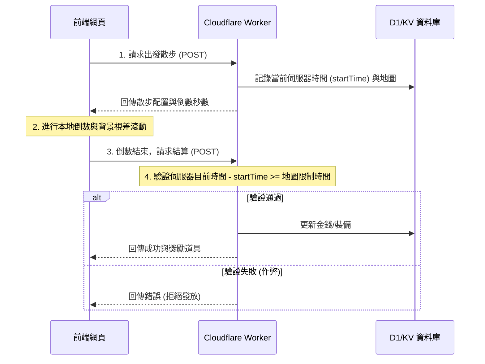

# 《Summer Park》完整升級與技術架構設計方案

本文件針對《Summer Park - 柯基養成公園》從靜態網頁升級為**體驗流暢、具備長線留存與高度沉浸感**的完整作品，從「素材與視覺表現（Assets & UI/UX）」以及「程式架構與邏輯（Code & Architecture）」兩個維度，提出具體的優化方向與實作細節。

---

## 🎨 一、 素材與視覺表現改進 (Assets & UI/UX)

遊戲的靈魂在於即時且豐富的「回饋感」，目前最需要解決的是寵物的「生命力」與介面的互動細節：

### 1. 實作動態回饋與角色動畫
* **現狀**：目前柯基為靜態圖片。
* **優化方案**：準備多套動態素材（可採用 GIF、Sprite Sheet，或使用 Lottie / Spine 2D 骨骼動畫技術）。
* **必備動畫狀態**：
  * **待機呼吸 (Idle)**：耳朵抖動、尾巴輕搖、腹部起伏。
  * **睡覺 (Sleep)**：閉眼、冒鼻涕泡泡、徐緩呼吸。
  * **開心搖尾巴 (Happy)**：正面對著玩家、狂搖尾巴、小碎步。
  * **散步跑步 (Run/Walk)**：側身跑步、舌頭伸長、小短腿快速擺動。

### 2. 視覺化狀態數值
* **現狀**：飽食度、清潔度等僅以百分比文字顯示。
* **優化方案**：
  * 使用**卡通風格進度條**（如加粗描邊與亮色填充）。
  * 讓數值狀態**動態影響**柯基動畫：例如飽食度或心情低於 30% 時，柯基動畫切換為「趴著無力」狀態，並在頭頂顯示肚子餓或生氣的對話泡泡。

### 3. 加入聽覺回饋
* **優化方案**：在設定區塊的音效開關下，實際掛載以下音效素材：
  * **背景音樂 (BGM)**：輕快、夏日休閒風的烏克麗麗或木琴音樂。
  * **按鈕點擊音效**：清脆的「啵」聲或木質感點擊聲。
  * **獲得代幣音效**：取得狗骨頭時的清脆硬幣聲。
  * **扭蛋慶祝音效**：抽中 SSR 裝備時的華麗號角與慶祝旋律。
  * **角色語音**：柯基偶爾發出的短促汪汪聲或撒嬌聲。

### 4. 優化 UI 狀態與層級
* **優化方案**：區分可互動按鈕與純文字。
  * 為所有按鈕（特訓、出發散步、扭蛋等）加上明確的**黑邊框**與**實色偏移陰影**。
  * 為所有可點擊元素加上 **Hover（滑鼠懸停）向上微調、Active（按壓時）向下縮放** 的微動畫，讓玩家產生即時的視覺操作反饋。

---

## 💻 二、 程式架構與實作改進 (Code & Architecture)

底層架構的穩固性是決定遊戲是否能擴充與長線運作的關鍵：

### 1. 修復前端建置與模組化掛載
* **編譯檢查**：確保編譯/打包後的 `index.html` 透過 `<script type="module" src="...">` 正確載入主入口檔案（如 `js/main.js`）。
* **DOM 綁定**：若未來引入前端框架，確保入口檔案有成功綁定對應的 DOM 掛載點（如 `<div id="app">`）。

### 2. 建立核心狀態管理 (State Management)
* **單一資料流**：遊戲內數值變更頻繁（如時間流逝 ➔ 飽食度下降 ➔ 觸發畫面渲染）。
* **實作方式**：
  * **原生 JavaScript**：實作一個全域的 `GameState` 類別，或使用 `Proxy` 監聽資料變更，當 state 被修改時自動觸發訂閱的渲染器（如 `render.js`）更新 UI。
  * **框架方案**：若使用框架，導入 Pinia (Vue) 或 Zustand/Redux (React) 來集中管理「代幣、屬性、背包、計時器狀態」。

### 3. 正確的時間與放置邏輯 (Idle Logic)
* **避開 `setInterval` 陷阱**：瀏覽器分頁切換到後台或手機鎖屏時，`setInterval` 會變慢甚至停止，導致散步時間不準確。
* **正確時間戳記邏輯**：
  1. 玩家按下「出發散步」時，記錄預計完成的時間戳記 `adventureEndTime` (當前時間 + 散步所需時間)。
  2. 畫面上的倒數計時僅作為視覺呈現（以 `adventureEndTime` 減去當前系統時間）。
  3. 當玩家重新打開網頁時，比對當前時間與 `adventureEndTime`，若大於等於該時間戳記，則立即結算獎勵，如此即便關閉網頁也不會影響進度。

### 4. 本地持久化與雲端存檔 (Data Persistence)
* **本地存檔 (LocalStorage)**：
  * 撰寫一個資料序列化工具，在遊戲核心狀態（金錢、裝備、屬性）變更時，將狀態物件 `JSON.stringify` 後寫入 `localStorage`。
  * 每次網頁初始化時，優先讀取本地存檔並還原狀態。
* **雲端同步 (Cloudflare Workers)**：
  * 提供「上傳存檔」功能：發送 POST 請求將 JSON 存檔發送至後端資料庫（KV 或 D1）儲存。
  * 提供「下載存檔」功能：拉取伺服器端的 JSON 數據並覆蓋本地狀態。

### 5. 抽卡機率邏輯的封裝
* **扭蛋模組化**：將「屁屁挖寶扭蛋」的機率（5% SSR、25% SR、70% N）寫入獨立的隨機模組。
* **權重演算法**：
  ```javascript
  // 隨機數生成範例
  function drawGacha(pool) {
    const totalWeight = pool.reduce((sum, item) => sum + item.weight, 0);
    let random = Math.random() * totalWeight;
    for (const item of pool) {
      if (random < item.weight) return item;
      random -= item.weight;
    }
  }
  ```
* 確保在扣除「黃金骨頭」後才呼叫此隨機模組，並將獲得的裝備推入背包數組中。

---

## 🛠 三、 核心前端架構：組件化與動態圖層疊加 (CSS Layering)

為了避免為每套換裝單獨繪製完整圖片導致資源包膨脹，採用 **娃娃放大鏡（Paper Doll）** 多圖層疊加技術。

### 1. HTML5 Canvas 或 CSS 絕對定位疊加
在主畫面中，柯基的外觀由多張透明 WebP 圖片在同一個坐標軸上動態組合而成：

```html
<div id="corgi-character" class="corgi-container state-idle">
  <!-- 陰影圖層 -->
  
  <!-- 柯基本體圖層 -->
  
  <!-- 服裝圖層 -->
  
  <!-- 頭部裝飾圖層 -->
  
  <!-- 背部/配件圖層 -->
  
  <!-- 粒子/特效圖層 -->
  <canvas id="layer-effects" class="layer effects"></canvas>
</div>
```

### 2. CSS 實作微交互與動態效果
透過 CSS 變數與動畫，程式碼僅需切換容器的 Class，即可控制整體角色動畫：

```css
.corgi-container {
  position: relative;
  width: 300px;
  height: 300px;
}
.layer {
  position: absolute;
  top: 0;
  left: 0;
  width: 100%;
  height: 100%;
  pointer-events: none; /* 讓滑鼠點擊穿透到容器 */
}

/* 待機呼吸動畫 */
@keyframes breathing {
  0% { transform: scale(1); }
  50% { transform: scale(1.02) translateY(-2px); }
  100% { transform: scale(1); }
}
.state-idle .body, .state-idle .clothes, .state-idle .head {
  animation: breathing 3s ease-in-out infinite;
  transform-origin: bottom center;
}

/* 髒污濾鏡效果：不需要繪製髒污貼圖，直接以 CSS filter 實現 */
.state-dirty .body {
  filter: sepia(30%) saturate(80%) hue-rotate(-10deg);
}
```

---

## 🏃 四、 關鍵玩法技術實作與素材搭配

### 1. 點子 2：物理觸控撫摸（Interactive Petting）
* **素材需求**：散落的愛心粒子小圖 (`heart.png`)。
* **程式碼實作**：
  監聽柯基容器的 `pointermove`（支援滑鼠與手機觸控）。當滑鼠按下並移動距離大於閥值時，動態生成愛心小圖：

```javascript
let isDrawing = false;
const container = document.getElementById('corgi-character');

container.addEventListener('pointerdown', () => isDrawing = true);
container.addEventListener('pointerup', () => isDrawing = false);
container.addEventListener('pointermove', (e) => {
  if (!isDrawing) return;
  
  // 建立愛心粒子
  const heart = document.createElement('div');
  heart.className = 'floating-heart';
  const rect = container.getBoundingClientRect();
  heart.style.left = `${e.clientX - rect.left}px`;
  heart.style.top = `${e.clientY - rect.top}px`;
  
  container.appendChild(heart);
  
  // 動畫播放結束後自動銷毀，釋放記憶體
  heart.addEventListener('animationend', () => heart.remove());
});
```

### 2. 點子 29、40：視覺化冒險橫軸與地圖（Visual Expedition）
* **素材需求**：
  1. 遠景、中景、近景背景圖（用於視差滾動 Parallax Scrolling）。
  2. 柯基跑步精靈圖（Sprite Sheet，包含 4-8 幀跑步動作）。
* **實作方式**：
  * **精靈圖播放**：使用 CSS `steps()` 控制，無需依賴第三方遊戲引擎。
    ```css
    .state-running .body {
      background: url('./assets/corgi/run-sprite.png') no-repeat;
      width: 120px; /* 單幀寬度 */
      height: 120px; /* 單幀高度 */
      animation: walk-cycle 0.6s steps(6) infinite; /* 6 幀動畫 */
    }
    @keyframes walk-cycle {
      from { background-position: 0px 0px; }
      to { background-position: -720px 0px; }
    }
    ```
  * **進度計算**：使用 `requestAnimationFrame` 持續更新背景圖的 `background-position-x`。前進速度與柯基 `Speed` 屬性連動：
    $$\text{Distance} = \text{Speed} \times \text{ElapsedTime}$$
  * 當 Distance 達到地圖長度時，向 Cloudflare Worker 發送結算請求。

### 3. 點子 51：魔性挖寶屁屁動畫（Corgi Butt Gacha）
* **素材需求**：柯基背對畫面抖屁股的精靈圖 (`butt-shake-sprite.png`)、噴飛的泥土粒子。
* **實作方式**：
  1. 點擊「挖寶扭蛋」時，隱藏正面柯基，切換為背面抖屁股 CSS 動畫。
  2. 啟動定時器，在前 2 秒於屁屁兩側隨機生成「泥土 div」並配合 CSS 拋物線動畫拋射。
  3. 第 2.5 秒時，彈出扭蛋金卡（SSR）或銀卡（SR/N）進行翻牌 Reveal。

---

## 🌐 五、 後端整合：Cloudflare Workers 與防作弊架構

為防止玩家修改本機時間刷取資源，必須建立嚴密的防作弊流程：

### 1. 散步防作弊流程


### 2. 雲端存檔資料結構（D1 / KV JSON 設計）
```json
{
  "userId": "user_123456789",
  "lastSync": 1781017432, 
  "attributes": {
    "speed": 15,
    "charm": 12,
    "iq": 24,
    "weight": 5.4
  },
  "status": {
    "hunger": 85,
    "cleanliness": 100,
    "mood": 90,
    "currentState": "ADVENTURING",
    "adventureTarget": "forest_camp",
    "adventureEndTime": 1781017732
  },
  "inventory": {
    "bones": 450,
    "goldBones": 5,
    "unlockedCosmetics": ["straw_hat_n", "sunglasses_sr", "bee_suit_ssr"],
    "equipped": {
      "head": "straw_hat_n",
      "body": "bee_suit_ssr",
      "back": null
    }
  }
}
```

---

## 📈 六、 效能優化策略：流暢網頁體驗的關鍵

由於 PWA 需要支援手機與電腦瀏覽器，因此資源下載速度與記憶體釋放至關重要：

1. **圖片格式優化 (WebP / AVIF)**：
   所有裝飾品與柯基素材一律轉為 WebP/AVIF 格式，比傳統 PNG 縮減 70% 以上的檔案大小，且完美保留透明度。
2. **精靈圖打包 (Texture Packing / Sprite Sheets)**：
   將所有互動小圖示（小點心、泡泡、愛心粒子）打包成單張大圖，利用 CSS `background-position` 定位讀取，將網路請求數從數十個縮減為 1 個，大幅加快載入速度。
3. **動態素材預載 (Asset Preloading)**：
   當玩家點擊功能抽屜（例如扭蛋頁籤）時，背景非同步預載挖寶動畫與特效圖，確保玩家點擊開始按鈕時動畫「零延遲」流暢播放。
